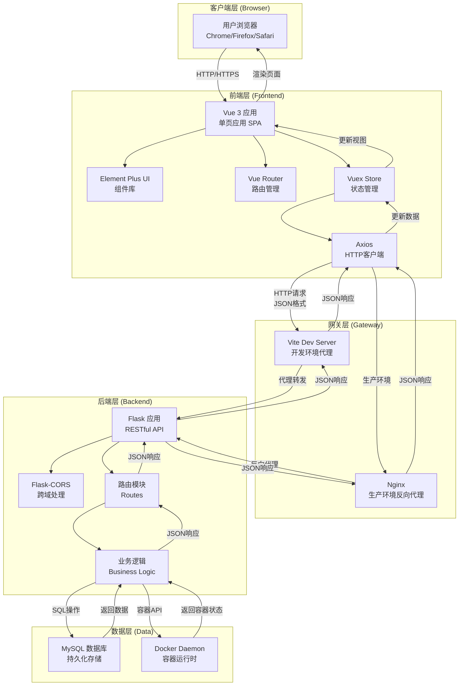
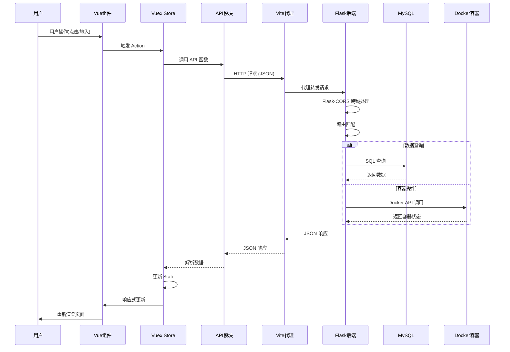
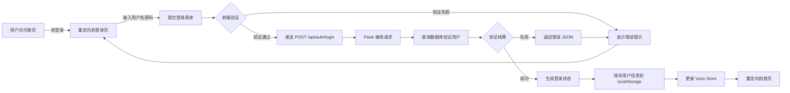
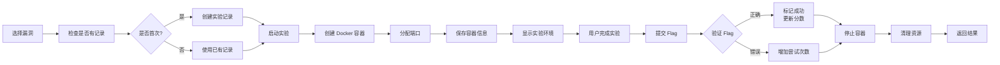
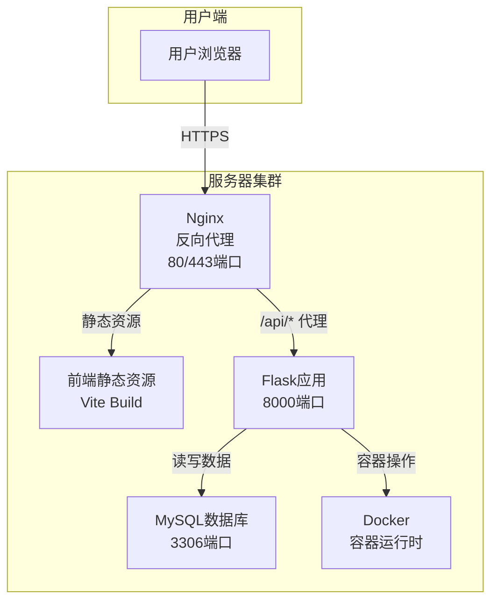

# Mlai-Lab B/S 架构与前后端分离技术

## 目录
1. [系统总体架构](#系统总体架构)
2. [技术栈详解](#技术栈详解)
3. [前后端通信流程](#前后端通信流程)
4. [数据流程图](#数据流程图)
5. [部署架构](#部署架构)

---

## 系统总体架构



---

## 技术栈详解

### 前端技术栈

| 技术 | 版本 | 用途 | 文件位置 |
|------|------|------|---------|
| Vue 3 | ^3.3.13 | 核心框架，组件化开发 | [package.json](file:///home/yu/Mlai-lab/frontend/package.json#L11) |
| Vue Router | ^4.2.5 | 单页应用路由管理 | [package.json](file:///home/yu/Mlai-lab/frontend/package.json#L12) |
| Element Plus | ^2.3.12 | UI组件库 | [package.json](file:///home/yu/Mlai-lab/frontend/package.json#L13) |
| Vite | ^5.0.8 | 构建工具，开发服务器 | [vite.config.js](file:///home/yu/Mlai-lab/frontend/vite.config.js#L5) |

### 后端技术栈

| 技术 | 用途 | 文件位置 |
|------|------|---------|
| Flask | Web框架，RESTful API | [app.py](file:///home/yu/Mlai-lab/backend/app.py#L8) |
| Flask-CORS | 跨域资源共享 | [app.py](file:///home/yu/Mlai-lab/backend/app.py#L9) |
| MySQL | 关系型数据库 | [init_db.py](file:///home/yu/Mlai-lab/backend/init_db.py) |
| Docker SDK | 容器管理 | [routes/container.py](file:///home/yu/Mlai-lab/backend/routes/container.py) |

### 代理配置

开发环境通过 Vite 代理解决跨域问题：

```javascript
// vite.config.js
server: {
  port: 3000,
  proxy: {
    '/api': {
      target: 'http://127.0.0.1:8000',
      changeOrigin: true
    }
  }
}
```

---

## 前后端通信流程

### 完整请求-响应流程



### API 数据格式

**请求格式：**
```json
{
  "username": "student1",
  "password": "password123"
}
```

**响应格式：**
```json
{
  "success": true,
  "message": "操作成功",
  "data": {
    "id": 1,
    "username": "student1",
    "role": "student"
  }
}
```

---

## 数据流程图

### 用户登录流程



### 漏洞实验流程



---

## 部署架构

### 开发环境

```
┌─────────────────────────────────────────────────────────────┐
│                     开发环境 (localhost)                     │
├─────────────────────────────────────────────────────────────┤
│                                                             │
│  ┌──────────────────┐        ┌──────────────────┐         │
│  │  前端            │        │  后端            │         │
│  │  localhost:3000  │◄──────►│  localhost:8000 │         │
│  │  (Vite Dev Server│        │  (Flask)         │         │
│  │   + Proxy)       │        │                  │         │
│  └──────────────────┘        └──────────────────┘         │
│          │                           │                      │
│          └───────────────────────────┴────────────────────┐│
│                                                      MySQL││
│                                              localhost:3306││
│                                                            ││
│  ┌──────────────────────────────────────────────────────┐ │
│  │  Docker Engine                                       │ │
│  │  - 漏洞容器 (动态创建)                                │ │
│  │  - 容器网络隔离                                      │ │
│  └──────────────────────────────────────────────────────┘ │
└─────────────────────────────────────────────────────────────┘
```

### 生产环境



**部署配置文件示例：**

- 启动脚本：[start.sh](file:///home/yu/Mlai-lab/start.sh)
- 后端配置：[config.py](file:///home/yu/Mlai-lab/backend/config.py)
- Gunicorn配置：[gunicorn.conf.py](file:///home/yu/Mlai-lab/backend/gunicorn.conf.py)

---

## 核心优势

| 特性 | 传统B/S架构 | 前后端分离架构 |
|------|------------|--------------|
| 耦合度 | 高耦合 (模板渲染) | 低耦合 (API交互) |
| 开发效率 | 前后端依赖串行 | 前后端并行开发 |
| 技术选型 | 绑定后端模板 | 自由选择前端框架 |
| 扩展性 | 困难 | 易于水平扩展 |
| 复用性 | 低 | 高 (API可服务多端) |
| 用户体验 | 刷新整页 | SPA无刷新 |

---

## 文件结构概览

```
Mlai-Lab/
├── frontend/                    # 前端项目
│   ├── src/
│   │   ├── api/                # API 模块
│   │   ├── components/         # Vue 组件
│   │   ├── views/             # 页面组件
│   │   ├── router/            # 路由配置
│   │   ├── store/             # 状态管理
│   │   └── utils/             # 工具函数
│   └── vite.config.js         # Vite 配置
│
├── backend/                    # 后端项目
│   ├── app.py                 # Flask 应用入口
│   ├── routes/                # 路由模块
│   │   ├── auth.py            # 认证路由
│   │   ├── users.py           # 用户路由
│   │   ├── experiment.py       # 实验路由
│   │   └── container.py        # 容器路由
│   └── utils/                 # 工具模块
│
└── docker/                     # Docker 环境
    └── ...                    # 漏洞容器定义
```
