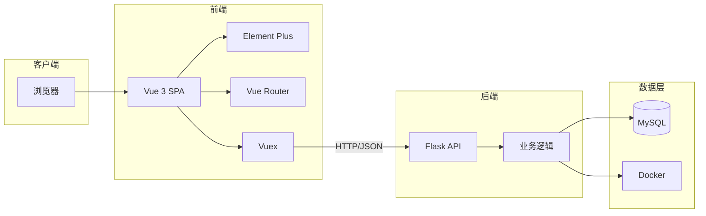
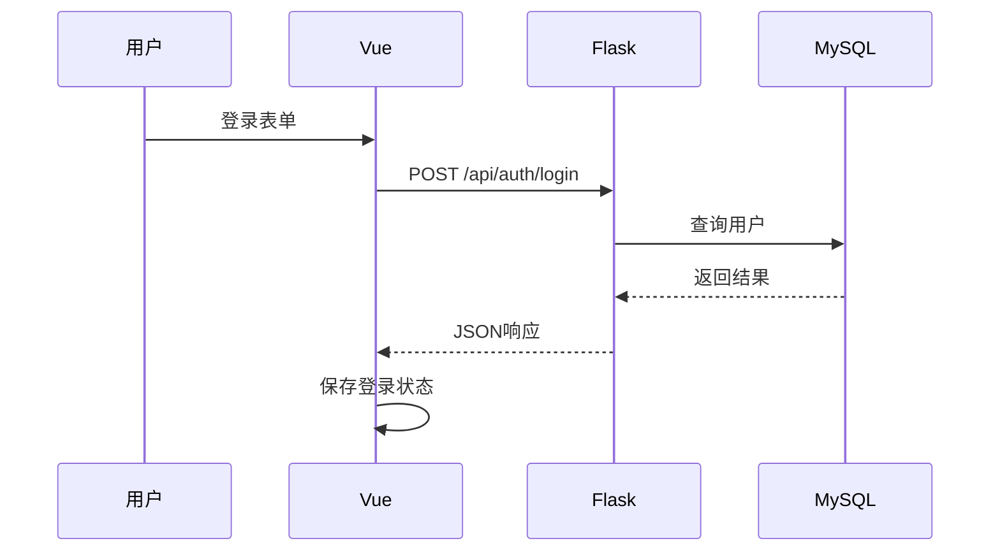
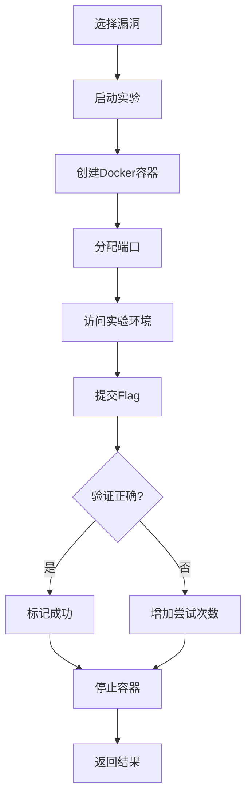

# Mlai-Lab B/S 架构图

## 一、系统架构



## 二、核心流程

### 用户登录流程


### 漏洞实验流程


## 三、技术栈

| 层级 | 技术 | 说明 |
|------|------|------|
| 前端 | Vue 3 + Element Plus | UI展示与交互 |
| 路由 | Vue Router | 页面导航 |
| 状态 | Vuex | 数据管理 |
| 后端 | Flask | RESTful API |
| 跨域 | Flask-CORS | 解决跨域问题 |
| 数据库 | MySQL | 数据存储 |
| 容器 | Docker | 漏洞环境隔离 |

## 四、部署架构

```
用户浏览器
    │
    ▼
┌─────────────────────────────────────┐
│          Nginx (80/443)           │  ← 反向代理
├─────────────────────────────────────┤
│   Frontend (静态资源)  Backend     │  ← 前后端分离
├─────────────────────────────────────┤
│         MySQL + Docker             │  ← 数据与容器
└─────────────────────────────────────┘
```

## 五、前后端通信

**请求格式：**
```json
{"username": "user", "password": "pass"}
```

**响应格式：**
```json
{"success": true, "message": "OK", "data": {...}}
```

---

*文档位置：* [architecture_simple.md](file:///home/yu/Mlai-lab/docs/architecture_simple.md)
